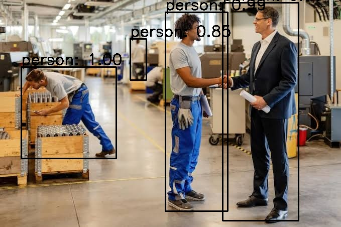

# YOLOv4 Object Detection using OpenCV



A lightweight Computer Vision project that performs real-time object detection on images using a pretrained **YOLOv4** model and **OpenCV DNN**. The project detects objects from the **COCO dataset (80 classes)** and draws bounding boxes with confidence scores.

This project demonstrates a simple and modular inference pipeline that can be extended for production deployments, REST APIs, or edge AI applications.

---

## Features

- YOLOv4 Object Detection using OpenCV DNN
- Detects 80 COCO object classes
- Confidence Threshold Filtering
- Non-Maximum Suppression (NMS)
- Batch Image Processing
- Automatic Output Image Generation
- Modular Python Implementation
- Easy to Extend for Video/Webcam Inference

---

## Tech Stack

- Python 3
- OpenCV
- YOLOv4
- NumPy
- Darknet Configuration Files

---

## Project Structure

```
YOLOv4-Object-Detection/
│
├── docs/
│   └── sample_output.jpg
│
├── input/
│   ├── images_1.jpg
│   └── images_2.jpg
│
├── output/
│   ├── images_1.jpg
│   └── images_2.jpg
│
├── yolov4_weights/
│   ├── yolov4.weights
│   ├── yolov4.cfg
│   └── obj.names
│
├── yolov4_code_simple.py
├── yolov4Run_simple.py
├── requirements.txt
├── README.md
└── .gitignore
```

---

## Detection Pipeline

```
Input Image
      │
      ▼
Image Preprocessing
      │
      ▼
YOLOv4 Network
      │
      ▼
Object Prediction
      │
      ▼
Confidence Threshold
      │
      ▼
Non-Maximum Suppression (NMS)
      │
      ▼
Draw Bounding Boxes
      │
      ▼
Save Output Image
```

---

## Installation

### 1. Clone Repository

```bash
git clone https://github.com/<your-username>/yolov4-object-detection.git

cd yolov4-object-detection
```

---

### 2. Install Dependencies

```bash
pip install -r requirements.txt
```

---

### 3. Download YOLOv4 Weights

The pretrained weights are too large to be stored in GitHub.

Download the weights from the official Darknet repository.

https://github.com/AlexeyAB/darknet/releases

Download

```
yolov4.weights
```

and place it inside

```
yolov4_weights/
```

Your folder should look like

```
yolov4_weights/
    ├── yolov4.weights
    ├── yolov4.cfg
    └── obj.names
```

---

### 4. Add Images

Place your input images inside

```
input/
```

Supported formats

- jpg
- jpeg
- png

---

## Run

```bash
python yolov4Run_simple.py
```

Detected images will automatically be saved inside

```
output/
```

---

## Sample Result

Input Image

```
input/images_1.jpg
```

↓

Output Image

```
output/images_1.jpg
```

Example Output


---

## Detection Classes

The pretrained model detects **80 COCO classes**, including

- Person
- Bicycle
- Car
- Motorcycle
- Bus
- Truck
- Traffic Light
- Dog
- Cat
- Chair
- Laptop
- Cell Phone

and many more.

---

## Detection Colors

| Class | Bounding Box Color |
|---------|-------------------|
| Person | Black |
| Bicycle | Green |
| Other Classes | Blue |

---

## Performance

Model

```
YOLOv4
```

Framework

```
OpenCV DNN
```

Input Resolution

```
416 × 416
```

Execution

```
CPU
```

GPU acceleration can be enabled by building OpenCV with CUDA support.

---

## Requirements

- Python 3.7+
- OpenCV >= 4.5
- NumPy >= 1.21

Install all dependencies using

```bash
pip install -r requirements.txt
```

---

## Future Improvements

- Webcam Object Detection
- Video Object Detection
- ONNX Model Export
- TensorRT Optimization
- FastAPI REST API
- Docker Support
- Real-Time Multi-Camera Detection
- Object Tracking (DeepSORT / ByteTrack)
- Custom YOLOv4 Training

---

## Learning Outcomes

This project demonstrates practical experience with

- Computer Vision
- Deep Learning Inference
- YOLOv4 Architecture
- OpenCV DNN Module
- Image Processing
- Object Detection
- Bounding Box Visualization
- Confidence Filtering
- Non-Maximum Suppression (NMS)
- Python Project Organization

---

## License

This project is released under the MIT License.

---

## Author

**Gokulnath N**

Computer Vision | Machine Learning | MLOps Engineer

LinkedIn: www.linkedin.com/in/gokulnath-n-b8690b247

GitHub: https://github.com/<your-username>